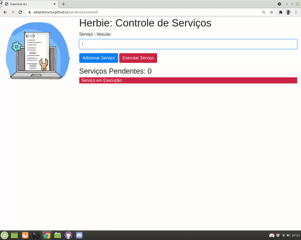

<h1 align="center"> Car service control </h1>
 
 
 
 
 
 
 

 
 
 > status: Developing ⚠️
 
 
 
 ## How to use this algorithm?

1. Enter service
     + Add the service and select the option "add service" from there the service will be added in the browser
3. run the service
     + To run the service click on the "Run service" option

## What does this algorithm consist of?

This program was developed in favor of those mechanics who need and want organization in their system, as the program basically stores the services saved by the store owner.

## Technologies used

<table> 
 <tr>
  <td>JavaScript</td>
  <td>HTML</td>
  <td>CSS</td>
  <td>BOOTSTRAP</td>
 </tr>
 <tr> 
  <td> ECMAS v8.0</td>
  <td> v5.0 </td>
  <td>v3.0</td>
  <td>v4.0.0</td>
 </tr>
</table>

## License
Repository covered by [MIT](http://escolhaumalicenca.com.br/licencas/mit/) license
